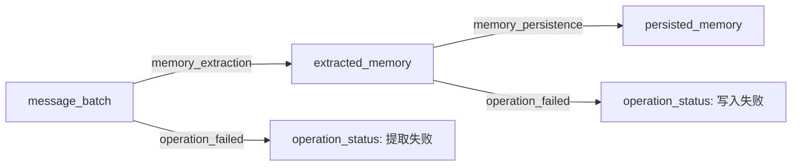
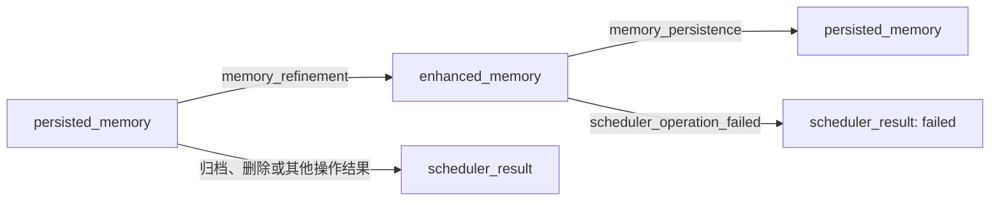
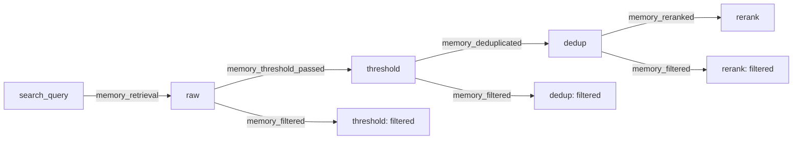

# memos_smartcomment 追踪数据约定

本文按当前实现整理，供阅读执行图、编写可视化和扩展 handler 时查阅。字段名和取值以代码为准；下列 `category`、`class_name` 都是字符串约定，未定义为强制枚举。

代码入口：[事件结构](events.py)、[公共处理](handlers/base.py)、[添加链路](handlers/add_handler.py)、[搜索链路](handlers/search_handler.py)、[图写入](recorder.py)。

## 1. 公共模型与身份

调用链为 `MemOS Hook → HookHandlers → TraceEvent → AsyncTraceAdapter → SmartCommentRecorder → JSON`。`HookHandlers` 组合 `AddHandler` 和 `SearchHandler`，两者也可以独立使用。

| 对象 | 表示什么 | 关键字段 |
| --- | --- | --- |
| `TraceValue` | 一份业务值快照，最终注册为图节点 | `name`、`value`、`identity`、`class_name`、`category`、`identity_only`、`comment`、`metadata`、`match_key` |
| `TraceEvent` | 一次 Hook 观测，最终建立一个 session 和一个 operation | `operation`、`category`、`trace_id`、用户/会话/cube 关联信息、`inputs`、`outputs`、`links`、`metadata`、`event_id`、`created_at` |
| `TraceLink` | 来源值到目标值的显式数据依赖 | `source`、`target`、`category`、`comment`、`metadata` |

`inputs` 和 `outputs` 只注册节点，**不会自动生成输入与输出之间的边**。只有 `links` 生成边；未单独列入输入/输出的 link 端点也会注册。操作发生的时间先后不构成连线依据。

### 1.1 `identity`、`name`、`full_node_id` 的区别

当前 `TraceValue` 的字段叫 **`identity`，没有 `identity_id` 字段**。本地 SmartComment 的节点导出也使用 `name`、`full_name`、`node_id`、`full_node_id`。如果讨论中说「identity_id」，应先明确是业务身份还是带版本的图节点 ID。

Recorder 用 `id_strategy` 返回 `TraceValue.identity`，因此映射如下：

| 字段 | 当前含义/构成 |
| --- | --- |
| `TraceValue.name` | handler 内的业务名称，如 `messages`、`query`、`raw_text_mem_1`；当前 recorder 不将它传给 SmartComment |
| `TraceValue.identity` | handler 构造的业务身份字符串 |
| 导出节点 `name` | 等于 `TraceValue.identity`，不是 `TraceValue.name` |
| 导出节点 `full_name` | `{class_name}:{identity}`；没有 `class_name` 时为 `{identity}` |
| 导出节点 `node_id` | `{identity}@{version}` |
| 导出节点 `full_node_id` | `{class_name}:{identity}@{version}`；边的 source/target 使用此字段 |

例如 `class_name="memory"`、`identity="memory:cube-1:mem-1"` 时，首版 `full_node_id` 是 `memory:memory:cube-1:mem-1@1`。两个 `memory` 分别来自类型命名空间和业务身份前缀。

这些身份目前通过冒号直接拼接，没有转义或解析协议。`trace_id` 本身也可能含冒号，读取图时不宜靠固定位置的 `split(":")` 还原字段。

### 1.2 图、操作、事件与 session 的作用域

| 标识 | 规则 |
| --- | --- |
| 图的隔离键 | Adapter 按 `(user_id, trace_id)` 管理图；`graph_id = trace_id`，`project_id` 来自配置，默认 `memos` |
| `operation_id` | 来自 Hook 业务上下文，用于关联一次业务操作；存在时由 `_event()` 补入 `TraceEvent.metadata` |
| `event_id` | 每次创建事件都生成一个 `uuid4().hex`，标识本次观测；不是业务 `operation_id` |
| `created_at` | 事件创建时的 UTC ISO 时间 |
| SmartComment `session_id` | 每个事件使用 `event-{event_id}`，session 名称是 `event.operation` |
| MemOS `session_id` | 业务会话 ID，导出时放在 session/operation metadata 的 `memos_session_id` 中 |
| SmartComment `op_id` | 由 SmartComment 创建 operation 时分配；业务 `operation_id` 仍在 metadata 中 |

即使两个 trace 出现相同 `identity`，也不会跨图合并。持久化记忆 identity 不含 trace，并不意味着全局只有一个节点。

`trace_id` 解析顺序：

1. 使用 subject 上非空且不等于占位值 `"trace-id"` 的 `trace_id`。
2. **仅当 subject 完全没有 `trace_id` 字段**时，尝试环境请求上下文。显式 `None`、空值或 `"trace-id"` 不会借用环境 trace。
3. 无有效 trace 且存在 `user_id`：`standalone:{user_id}:{session_id or 'default_session'}`。
4. 无 user 但有 task：`task:{task_id}`；两者都没有：`standalone:unknown:{session_id or 'default_session'}`。

`_hook_subject()` 保留显式空 trace 的语义。Search 另用请求补充 Hook 上为空的 `trace_id/user_id/session_id/task_id`，所以 Hook 的空 trace 可以由请求的有效 trace 补齐。

cube 列表取第一个非空字段：`writable_cube_ids → readable_cube_ids → mem_cube_ids → cube_ids`，转字符串并按原顺序去重；均无值则取 `mem_cube_id or cube_id`。单条记忆的默认 cube 只在恰好一个 cube 时确定；Add 的特定入口还可使用 `user_name` 作为存储 cube 的兜底，不能把它直接当成 `user_id`。

### 1.3 `identity_only` 与版本

| 情况 | 行为 |
| --- | --- |
| `identity_only=True` | 按身份引用已有节点；尚不存在时仍可创建节点，并非「不记录 value」 |
| 普通节点，身份和编码后的 value 相同 | SmartComment 复用已有版本 |
| 普通节点，身份相同但 value 不同，`identity_only=False` | 非 strict 模式创建新版本；strict 模式报一致性错误 |
| `category="persisted_memory"` | recorder 强制按身份复用，使用下面的不可变锚点规则 |

持久化记忆由 `(cube_id, memory_id)` 标识，保留第一次完整正文快照。仅有 ID 时先创建占位；完整快照到达后补全一次，保留原节点 ID 和连线。此后内容冲突只告警，不覆盖或升版，strict 模式也相同。恢复旧图时，同一持久化身份的多个版本合并到最早锚点，并保留首个完整快照及关联边。

普通节点复用时，不会因为新一次观测的 metadata/comment 不同就自动更新它们；逐次操作信息应查看对应 operation/edge。持久化占位补全是 recorder 的专门处理。

## 2. `TraceValue` 节点总表

下面的 `{cube}` 在 Add 链中表示 `cube_id or 'unknown'`；`{trace}` 为解析后的 trace。`{search_scope}` 优先使用非 `None` 的 `operation_id`，否则使用 trace。`{status}` 在调度链中为 `after` 或 `failed`。

### 2.1 AddHandler：输入、提取、持久化与后台增强

| `TraceValue.name` | `category` | `class_name` | `identity` | `value` |
| --- | --- | --- | --- | --- |
| `messages` | `message_batch` | `message_batch` | `message_batch:{trace}:{uuid4.hex}` | messages 的快照 |
| `extracted_memory` | `extracted_memory` | `memory` | `extracted_memory:{trace}:{cube}:{memory_id}` | 记忆正文 |
| `persisted_memory` | `persisted_memory` | `memory` | `memory:{cube}:{memory_id}` | 完整时为正文；引用/来源未知时为 `{"memory_id": ..., "cube_id": ...}` |
| `enhanced_memory` | `enhanced_memory` | `memory` | `enhanced_memory:{trace}:{cube}:{memory_id}` | 生成时为正文；后续持久化引用时为 ID/cube 字典 |
| `scheduler_result` | `scheduler_result` | `str` | `scheduler_result:{operation_id or 'unknown'}:{status}` | `"{operation_name} completed"` 或 `"{operation_name} failed"` |

正文统一优先取 `memory` 字段，仅当其为 `None` 时取 `text`；空字符串是有效正文。Add 遍历记录时要求同时有 ID 和正文，ID 优先取 `memory_id`，再取 `id`；不会递归遍历 `metadata/info/internal_info` 包装字段。

| 节点 | `TraceValue.metadata` 实际记录什么 |
| --- | --- |
| `message_batch`，在 `add.before` 创建 | `writable_cube_ids`、`async_mode`、`mode`、`custom_tags`、`info`、`chat_history`，均取自 request；字段缺失时值可为 `None` |
| `message_batch`，MemReader 引用 | 当前传入 `{}`；已有节点通常保留最初 metadata |
| `extracted_memory`，提取成功时创建 | `type`、`info`、`mode`、`user_name`，取自 MemReader Hook 参数 |
| `extracted_memory`，写入阶段引用 | 当前传入 `{}`，仍携带正文作为 value |
| `persisted_memory`，写入 Hook 输出 | `memos_stage`、`cube_id`、`memory_id`；stage 为 `text_memory.add.after` 或 `scheduler.mem_read.add_enhanced_memories.after` |
| `persisted_memory`，后台按 ID 引用 | `cube_id`、`memory_id`；此构造函数不添加 `memos_stage` |
| `enhanced_memory` | `cube_id`、`memory_id` |
| `scheduler_result` | `operation_id`、`operation_name`、`status` |

Recorder 对导出的 `persisted_memory.metadata` 额外添加 `snapshot_status="reference"` 或 `"complete"`。这个字段不在 handler 原始 `TraceValue.metadata` 中。

**这里的 metadata 不是源记忆 `memory.metadata` 的完整副本。** 例如 `memory_type`、`sources`、时间戳不会自动进入提取/持久化节点；`extracted_memory` 甚至不单独添加 `cube_id/memory_id` metadata，它们目前编码在 identity 中。

消息身份的关联规则：每次 `add.before` 分配新 UUID，即便重复使用同一个 messages 列表。短期缓存键为 `(trace_id, user_id, id(messages))`，验证请求仍持有同一个 messages 对象，再让各 cube 的 MemReader 引用同一批次。`id(messages)` 仅用于内存关联，不是图身份；未命中时分配独立 UUID。缓存默认最多 1024 个 pending add，各 cube 消费完、`add.after` 或 shutdown 时清理。

### 2.2 SearchHandler：查询与各阶段候选

| `TraceValue.name` | `category` | `class_name` | `identity` | `value` |
| --- | --- | --- | --- | --- |
| `query` | `search_query` | `str` | `search_query:{search_scope}` | 请求 query；无字段时默认空字符串 |
| `{stage}_{result_type}_{rank}` | `search_memory` | `search_memory` | `search_memory:{search_scope}:{stage}:{result_type}:{cube_scope}:{occurrence_id}:{global_position}` | `memory_id`、`memory`、`result_type`、`cube_id`、`score` 五字段字典 |
| `{stage}_filtered` | `search_filter_result` | `str` | `search_filter_result:{search_scope}:{stage}` | 固定字符串 `"filtered"` |

| 搜索身份/位置字段 | 规则 |
| --- | --- |
| `stage` | `raw`、`threshold`、`dedup`、`rerank` |
| `result_type` | results 顶层 key 转字符串，例如 `text_mem`、`pref_mem`；handler 没有限定枚举，也不是源记忆的 `memory_type` |
| `cube_scope` | cube ID 非 `None` 时使用该 ID，否则使用 `bucket-{bucket_index}` |
| `occurrence_id` | memory ID 非 `None` 时使用该 ID，否则 `anonymous`；Search 取 ID 的顺序为 `id or memory_id` |
| `bucket_index` | 同一 result type 内的桶序号，从 0 开始 |
| `rank` | 当前桶内排名，从 1 开始；不代表所有 cube 合并后的排名 |
| `rank_scope` | `f"{result_type}:{cube_id or bucket_index}"`，用于说明排名所在桶；它与 `cube_scope` 的兜底写法不同 |
| `global_position` | 当前阶段遍历所有 result type 和桶时的位置，从 1 开始；不是全局按分数排序的名次 |
| `score` | 依次取源记忆 `metadata.relativity → metadata.score → memory.score`，仅遇到 `None` 才继续兜底，因此 `0` 有效 |

| 节点 | `TraceValue.metadata` |
| --- | --- |
| `search_query` | `memos_stage="search.before"` |
| `search_memory` | `stage`、`result_type`、`cube_id`、`memory_id`、`rank`、`rank_scope`、`global_position`、`score` |
| `search_filter_result` | `stage`、`status="filtered"` |

候选的 `comment` 同时写明 stage、rank、rank_scope、global_position，以及非 `None` 的 score。搜索节点的阶段字段叫 `stage`，不是 `memos_stage`。

Search 消费的形状是 `result_type → 桶列表 → memories 列表`，例如：

```python
results = {
    "text_mem": [
        {
            "cube_id": "cube-1",
            "memories": [
                {"id": "mem-1", "memory": "示例记忆", "metadata": {"relativity": 0.8}}
            ],
        }
    ]
}
```

当前实现不解包 `{"data": results}`。传入回调时应提供业务 results 字典。

每个阶段都会建立新的 `search_memory` 节点，即使正文和顺序未变；同 ID 重复出现也由 `global_position` 区分。它们不复用 Add 的 `persisted_memory` 节点。

跨阶段配对使用另外的 `match_key`：

```text
SHA256(UTF8(JSON([result_type, cube_scope, ["id", str(memory_id)]])))
无 ID 时，最后一项改为 ["text", 原始未截断正文]
```

具体 JSON 编码使用 `json.dumps(..., ensure_ascii=False)`。匹配不包含 stage、rank、score；有 ID 时正文改变仍可关联。重复项按 FIFO 一对一消费。`match_key` 保存在 `TraceValue` 中供 handler 缓存使用，当前 recorder 不将它导出到节点或 metadata。

### 2.3 BaseHandler：通用失败状态

| 字段 | 取值 |
| --- | --- |
| `name / category` | 均为 `operation_status` |
| `class_name / value` | `str` / `"failed"` |
| `identity` | `operation_status:{operation_id or trace_id}:{stage}` |
| `metadata` | `memos_stage=stage`、`status="failed"` |
| 当前 stage | `mem_reader.extract.failed`、`text_memory.add.failed`、`search.post_process.failed` |

MemRead 调度失败使用上一节的 `scheduler_result`，不使用这个节点。异常类型 `error_type` 放在事件/操作 metadata 中；异常对象和异常消息不作为失败节点内容。

当前 handler 共使用 **4 种 class_name**：`message_batch`、`memory`、`str`、`search_memory`；共使用 **9 种节点 category**：以上表格中的五种 Add、三种 Search 和一种通用失败状态。`TraceValue` 自身的默认 `category="variable"`、`class_name=None` 供自定义调用使用，当前 handler 显式指定这两个字段。

## 3. AddHandler 的 operation 与连线

### 3.1 同步添加



图中失败分支按实际失败 Hook 出现，不会因为存在成功分支自动生成。

| Hook | `TraceEvent.operation` | 事件/操作 `category` | 输入 → 输出 / 边 category |
| --- | --- | --- | --- |
| `add.before` | `memos.add.message_input` | `memory_add_request` | 创建 message_batch 根节点，无边 |
| `add.after` | 不发事件 | — | 只清理 pending 消息关联 |
| `mem_reader.extract.after` | `memos.mem_reader.extract` | `memory_extraction` | message_batch → 每条 extracted_memory；`memory_extraction` |
| `mem_reader.extract.failed` | `memos.mem_reader.extract.failed` | `memory_extraction` | message_batch → operation_status；`operation_failed` |
| `text_memory.add.after` | `memos.text_memory.persist` | `memory_persistence` | 匹配到的 extracted_memory → persisted_memory；`memory_persistence` |
| `text_memory.add.failed` | `memos.text_memory.persist.failed` | `memory_persistence` | 各 extracted_memory → operation_status；`operation_failed` |

| 操作 | 由 handler 添加的 `TraceEvent.metadata`，不含公共补充字段 |
| --- | --- |
| `memos.add.message_input` | `writable_cube_ids`、`async_mode`、`mode`、`custom_tags`、`info`、`chat_history` |
| `memos.mem_reader.extract` | `type`、`info`、`mode`、`user_name` |
| `memos.mem_reader.extract.failed` | 上述四项，加 `memos_stage="mem_reader.extract.failed"`、`status="failed"`、`error_type` |
| `memos.text_memory.persist` | `memos_stage="text_memory.add.after"`、`memory_count`、`lineage_status`、`backend`（text_memory 的类名） |
| `memos.text_memory.persist.failed` | `memos_stage="text_memory.add.failed"`、`status="failed"`、`error_type`、`backend` |

注意 `memos_stage` 不是所有事件或节点的必有字段；成功的 add 输入、MemReader 提取事件目前不自动补它。

触发边界：反馈请求和空 messages 不产生 add 输入事件；MemReader 只观察 `type="chat"`，成功时要求消息和提取结果都非空。写入成功时，输入/输出都为空就不发事件；写入失败时，无可识别候选输入则不发失败事件。失败表示该操作失败，不承诺底层已经提交的部分写入被回滚。

这里的「写入成功」表示收到了成功 Hook 和返回 ID，插件不独立查询数据库确认。当前工作区的 `MemoryManager._submit_batches()` 捕获批量写入异常后只记录日志，可能导致失败写入仍走成功 Hook。因此不能仅凭 persisted_memory 节点认定实际写入成功；失败节点也依赖业务层正确传播异常。本次核对时，`test_write_failure_hooks.py` 的 4 个用例因此未通过。

### 3.2 持久化配对

同步写入和后台增强写入都按 **返回 memory ID 匹配唯一输入记录**，不按返回位置配对。返回值当前只接受 list/tuple 作为 ID 序列。

| 情况 | 节点和边 |
| --- | --- |
| 返回 ID 唯一匹配输入 | 使用该输入正文建立 persisted_memory，连来源边 |
| 返回 ID 不认识，或输入中同 ID 出现多次 | 保留只有 ID/cube 的 persisted_memory，不推测正文和来源边 |
| 部分输入没有对应返回 ID | 输入节点保留，不推测写入成功 |

持久化边额外包含 `pair_index`（返回 ID 序列下标）和 `input_index`（展开输入记录下标），均从 0 开始。匹配索引按 memory ID 构建；输入含多个相同 ID 时，即使来自不同 cube，也按歧义处理。

`lineage_status` 表示本次持久化输出的来源配对情况：所有输出都有来源边为 `resolved`，只有部分有边为 `partial`，有输出但无边为 `unresolved`。没有持久化输出和边时也为 `resolved`。`memory_count` 是构造出的输出数量，在 `_unique_values()` 去重前计数，不保证等于最终图中新增加的节点数。

### 3.3 MemRead 后台处理



只接受 `hook_context.source` 以 `scheduler.mem_read.` 开头的调度 Hook。去掉前缀得到 `operation_name`。

| 字段 | 约定 |
| --- | --- |
| 订阅 Hook | `scheduler.memory.operation.after` / `scheduler.memory.operation.failed` |
| `event.operation` | `memos.scheduler.mem_read.{operation_name}.{status}` |
| `event.category` | 固定 `scheduler_memory_operation` |
| 共同 metadata | `memos_stage="scheduler.mem_read.{operation_name}.{status}"`、`handler="mem_read"`、`operation_name`、`operation`、`target`、`status` |
| `operation / target` | 直接记录 Hook 参数，例如 `fine/add/archive/delete/soft_delete` 和 `textual_memory`；不是插件内强制枚举 |
| 失败额外 metadata | `error_type`，仅异常类名 |

| `operation_name` / 情况 | 输入、输出与边 category |
| --- | --- |
| `fine_transfer_simple_mem` 成功且有记忆输出 | operation_input.memories 中的持久化记忆引用 → enhanced_memory；`memory_refinement` |
| `add_enhanced_memories` 成功且有返回 ID | enhanced_memory → persisted_memory；`memory_persistence`，沿用唯一 ID 配对 |
| `archive_merged_memories` 成功 | memory_ids 对应持久化记忆 → scheduler_result；`memory_archival` |
| `remove_memories` / `remove_source_memories` 成功 | memory_ids 对应持久化记忆 → scheduler_result；`memory_deletion` |
| 其他操作成功，如 `refresh_memory_size` | memory_ids 对应持久化记忆 → scheduler_result；`scheduler_operation_result` |
| 失败 | 当前操作输入 → scheduler_result；`scheduler_operation_failed`；增强写入失败保留 enhanced_memory 输入 |

handler 并没有封闭的 operation_name 枚举：上述特殊分支之外，其他符合 source 前缀的名称按通用结果分支处理。成功的 fine-transfer/增强写入如果没有记忆输出，也会生成 scheduler_result；没有输入时保留独立结果节点和 operation，不补造边。

fine-transfer 额外记录 `result_grouping`，取自 `operation_input`，缺省 `unknown`：

| `result_grouping` / 输入情况 | 连线规则 |
| --- | --- |
| `per_input` 且外层结果组数等于输入数 | 按输入顺序逐组连接，一条输入可产生多条输出；失败/无输出对应的空组必须保留 |
| `batch` | 整批输入共同连接到每个输出 |
| 只有一个输入 | 即使 grouping 未知，也可以把输出连接到唯一输入 |
| 多输入且 grouping 未知，或 per_input 组数不一致 | 保留输入/输出，但不猜来源边 |

fine-transfer 成功且存在 enhanced_memory 输出时，`lineage_status` 取 `resolved`（存在来源边）或 `unresolved`（无来源边），没有 `partial` 分支。增强写入成功则使用上一节的持久化 lineage 规则。插件本身消费 Hook 提供的 grouping，不识别 Reader 的具体类。

## 4. SearchHandler 的 operation 与连线



raw、threshold、dedup、rerank 框都表示 `search_memory` 节点。

| Hook | `TraceEvent.operation` | 事件/操作 `category` | 主要边 category |
| --- | --- | --- | --- |
| `search.before` | `memos.search.request` | `search_request` | query 根节点，无边 |
| `search.memory_results` | `memos.search.retrieve` | `memory_retrieval` | query → raw；`memory_retrieval` |
| `search.results.after_threshold` | `memos.search.threshold_filter` | `memory_filtering` | raw → threshold；`memory_threshold_passed` |
| `search.results.after_dedup` | `memos.search.deduplicate` | `memory_deduplication` | threshold → dedup；`memory_deduplicated` |
| `search.results.after_rerank` | `memos.search.rerank` | `memory_reranking` | dedup → rerank；`memory_reranked` |
| `search.post_process.failed` | `memos.search.post_process.failed` | `search_failure` | query → operation_status；`operation_failed` |

threshold、dedup、rerank 中，前一阶段未匹配到的候选都以 `memory_filtered` 连到当前阶段共用的 `search_filter_result`。因此 `filtered` 不只表示阈值未通过，也包括去重删除及 rerank 阶段消失的候选。新出现且找不到来源的候选仍保留，不连推测边。

| 操作 | 由 handler 添加的 `TraceEvent.metadata`，不含公共补充字段 |
| --- | --- |
| request | `memos_stage="search.before"` |
| retrieve | `memos_stage="search.memory_results"`、`top_k` |
| threshold_filter | `memos_stage="search.results.after_threshold"`、`threshold`（request.relativity，空值按 0）、`score_field="metadata.relativity"`、`applied=(threshold > 0)` |
| deduplicate | `memos_stage="search.results.after_dedup"`、`method`（request.dedup，缺省/空值按 `no`）、`applied=(method in {sim, mmr})`、`top_k` |
| rerank | `memos_stage="search.results.after_rerank"`、`algorithm="relativity_sort"`、`order_by="metadata.relativity"`、`direction="descending"`、`top_k` |
| post_process.failed | `memos_stage="search.post_process.failed"`、`status="failed"`、`error_type`、`handler`（API handler 的类名） |

四个结果阶段另加 `link_strategy="explicit_pairwise"` 和 `filtered_count`。raw 阶段 filtered_count 为 0；其余阶段是前一阶段未匹配候选数。rerank 的 algorithm/order_by/direction 是插件当前固定写入的描述，不是对实际后端算法的动态识别；插件也不自己重新过滤、去重或排序。`top_k` 是当前 Hook 请求中的值，可能已经被业务层扩充。

缓存键为 `(trace_id, search_scope_id, stage)`。rerank 和 post_process.failed 清理本次搜索的所有阶段缓存，shutdown 清理全部。若缺少 `operation_id`，search_scope 退回 trace，此时同 trace 多次搜索不再具有独立身份，调用方应提供一次搜索各 Hook 共享的 operation_id。

观测终点为 `search.results.after_rerank`；插件没有订阅 `search.context.render` 或 `search.after`。

## 5. metadata 分层与合并规则

| 层级 | 内容 | 自动继承情况 |
| --- | --- | --- |
| 节点 `TraceValue.metadata` | 第 2 节列出的值身份、阶段、排名或输入参数 | 不自动继承事件 metadata、HookContext.attributes 或源记忆的完整 metadata |
| 事件 `TraceEvent.metadata` | 第 3/4 节列出的本次操作参数和结果说明 | `_event()` 在 subject.operation_id 非 `None` 时用 setdefault 补 `operation_id` |
| 导出 operation metadata | 事件 metadata，加关联公共字段 | 公共字段覆盖事件 metadata 同名项 |
| 导出 edge metadata | operation metadata，加 `TraceLink.metadata` | link 字段优先；持久化边额外有 pair_index/input_index |
| 导出 session metadata | 单独构造的事件关联字段 | 不自动复制完整 event metadata |

Recorder 的公共字段如下：

```python
operation_metadata = {
    **event.metadata,
    "trace_event_id": event.event_id,
    "memos_trace_id": event.trace_id,
    "memos_session_id": event.session_id,
    "task_id": event.task_id,
    "cube_ids": list(event.cube_ids),
}
edge_metadata = {**operation_metadata, **link.metadata}

session_metadata = {
    "memos_session_id": event.session_id,
    "task_id": event.task_id,
    "cube_ids": list(event.cube_ids),
    "trace_event_id": event.event_id,
    "trace_event_created_at": event.created_at,
}
```

`user_id` 由 graph 持有并进入 SmartComment 对象的顶层字段，不在以上公共 metadata 字典中。link 未指定 category/comment 时沿用 operation；`event.category` 同时作为 operation 和 session 的 category，**不会把节点 category 改成操作 category**。

目前只有持久化配对边显式添加 link metadata，其他 handler 边使用空字典并继承 operation metadata。

## 6. 快照、导出与边界

`_value()` 对 value 和 metadata、`_event()` 对事件 metadata，在 Hook 当前线程内执行快照；后台线程负责写图。dataclass 的 frozen 只禁止字段重新赋值，不深度冻结嵌套字典。

| 规则 | 当前行为 |
| --- | --- |
| 字符串长度 | 默认保留前 20,000 字符，超出追加 `…`；限制按每个字符串计算 |
| 容器大小 | 默认每层最多 200 项，附截断提示；不等于一个事件最多 200 个节点 |
| 敏感字段 | 字段名规范化后包含 api_key/apikey/access_key/password/secret/authorization/cookie/credential/token 时，值替换为 `<redacted>` |
| 向量字段 | embedding/embeddings/vector/vectors 的值替换为 `<omitted-vector:长度>` |
| argument/arguments JSON 字符串 | 先解析并递归脱敏，再编码和截断；不能解析为 dict/list 则替换为 `<omitted-unparseable-arguments>` |
| 自由文本 | 按长度截断，不扫描正文中的任意凭据 |
| 其他类型 | 循环引用用 `<cycle>`，bytes 用长度标记，非有限浮点数转字符串，模型/对象尽可能展开字段 |
| 导出节点 value | 用 `json.dumps(value, ensure_ascii=False, sort_keys=True)` 编码为字符串；消费导出 JSON 时需对 node.value 再做一次 JSON 解码 |
| 内部哨兵 | 导出移除 `COMMENT:NONE@1` 及其关联边、`__none_op__` 和 `__none__` session |

身份和 comment 并不经过 `_value()` 的 value/metadata 快照流程。队列入满会丢弃追踪事件并告警，所以图用于记录已观测到的数据依赖，不能把缺失节点/边直接解释为业务步骤从未发生。

输出文件按 user/trace 隔离，目录名和文件名为经过清洗且最多 80 字符的可读前缀，加原始 ID 的 JSON 编码的 SHA-256；文件原子替换，后续事件可恢复已有图。缓存淘汰不删除磁盘快照。配置和运行方式见 [应用 README](../README.md)。

## 7. 查代码与扩展时的检查点

| 问题 | 主要实现 |
| --- | --- |
| trace/cube 从哪里来 | [base.py](handlers/base.py)：`_current_trace_id`、`_cube_ids`、`_hook_subject` |
| Add 身份与 metadata | [add_handler.py](handlers/add_handler.py)：`_message_value`、`_extracted_memory_value`、`_persisted_memory_value`、`_enhanced_memory_value` |
| 返回 ID 怎么连回输入 | [add_handler.py](handlers/add_handler.py)：`_persistence_values`、`_persistence_lineage` |
| 后台增强的来源关系 | [add_handler.py](handlers/add_handler.py)：`_fine_transfer_values`、`_on_scheduler_memory_operation` |
| 搜索节点、排名、跨阶段配对 | [search_handler.py](handlers/search_handler.py)：`_search_result_items`、`_search_memory_value`、`_search_memory_match_key`、`_match_search_nodes` |
| 图中身份、metadata、占位补全 | [recorder.py](recorder.py)：`_as_comment_item`、`record`、`_complete_memory_snapshots` |
| 快照与落盘 | [serialization.py](serialization.py)、[adapter.py](adapter.py) |

新增节点时要明确身份作用域、value 形状、class_name、节点 category 和引用方式；新增操作时要独立定义 operation/category/metadata，并依据已知业务来源显式创建 TraceLink。来源无法确认时保留节点，不用操作顺序或输入输出下标推测边。
